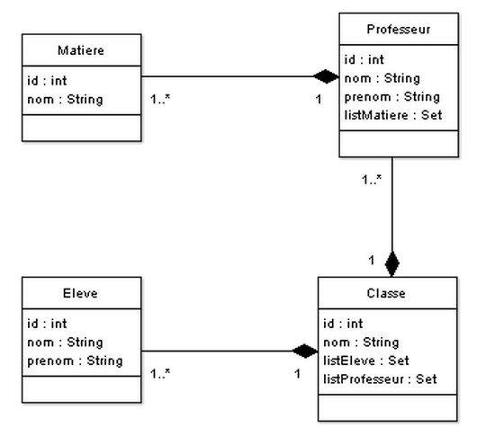
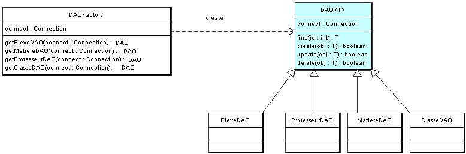

JDBC-Ecole
==========

1) Afficher le contenu de la table Eleve avec un Statement .
2) Modifier un Eleve avec un prepareStatement

3)Le modéle DAO
a) Crée les objects Eleve, Classe, Professeur, Matiere

b) Crée la classe abstracte DAO<T>

c) Crée les 4 DAO qui herite de DAO

D) Crée la classe DAOFactory qui implement le patterm factory

